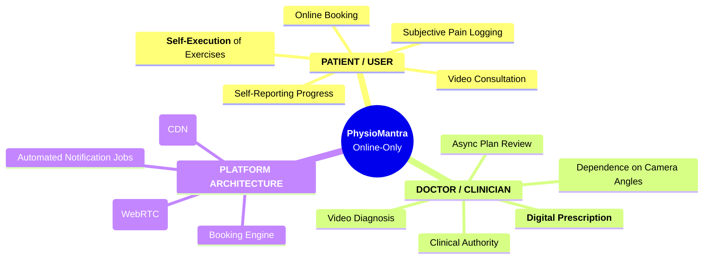

# System Architecture Analysis: Hybrid Care Extensions
**Reference ID:** PM-HYB-ARCH-001  
**Date:** 2026-01-20  
**Status:** DRAFT FOR REVIEW  

---

## 1. Executive Abstract

This document audits the structural implications of introducing a **Hybrid Care Delivery Model** into the existing PhysioMantra ecosystem. 

**Core Constraint:** The implementation must utilize **zero-code extensions** of current objects. No new modules, no parallel databases, and no independent clinical authority for the Assistant.

**Hypothesis:** By reconfiguring the "Assistant" role from a clinical entity to a **"Hardware Proxy" (Doctor's Hands)**, we can actuate physical care delivery without altering the fundamental database schema or clinical workflow logic.

---

## 2. Current State: The Online-Only Authority Model

In the current architecture, the clinical loop is "Open." The Doctor provides input (Diagnosis/Plan), but the feedback loop depends entirely on patient self-reports. This introduces a "Data Integrity Gap."

### key_characteristics:
*   **Single Actor Execution:** Patient is sole executor.
*   **Subjective Feedback:** "I felt pain" vs "Movement was 10 degrees restricted."
*   **High Drop-off Risk:** Lack of physical confidence leads to non-adherence.



---

## 3. Reconfigured State: The Hybrid Layer

The "Hybrid" model is defined not as a new product, but as a **tightly coupled execution layer**. The Assistant does not diagnose; they actuate.

### Structural Changes
1.  **Actor Addition:** Assistant added as `Role: EXECUTION_PROXY`.
2.  **Data Verification:** The feedback loop becomes "Closed" via verified inputs.
3.  **Inheritance:** Assistant inherits permissions strictly from the Doctor's active Plan.

### The "Hardware Proxy" Concept
The Assistant functions as a tangible extension of the Doctor. They do not hold clinical decision power. If the Doctor says "Flex to 30 degrees," the Assistant ensures "30 degrees" is met physically.

```mermaid
mindmap
  root((**PhysioMantra**<br/>Hybrid Config))
    **PATIENT / USER**
      ::icon(fa fa-user)
      Online Booking
      Video Consultation
      **Assisted Execution**
      Physical Safety & Confidence
      Reduced Cognitive Load
    **DOCTOR / CLINICIAN**
      ::icon(fa fa-user-md)
      **Remains Sole Authority**
      Same Diagnosis Flow
      **Selects 'Hybrid' Mode**
      Reviews Verified Data
      Directs Assistant via Notes
    **ASSISTANT (New Configuration)**
      ::icon(fa fa-hands-helping)
      **Execution Proxy**
      No Clinical Decisions
      Verifies Form Mechanics
      **Digital Entry for Patient**
      Captures Objective ROM Data
    **PLATFORM ARCHITECTURE**
      ::icon(fa fa-server)
      No New Module
      **Routes Plan to Assistant**
      Unified Data Stream
      Audit Log of Assistant Actions
```

---

## 4. Architectural Conclusion

The addition of the Assistant node **does not** require a schematic bifurcation of the product. 
*   **Database:** `Consultation` object simply gains a flag `mode: 'HYBRID'`.
*   **Permissions:** Assistant view is a read-only render of the `Doctor_Plan`.

This validates that **Hybrid is a Configuration, not a Product.**
