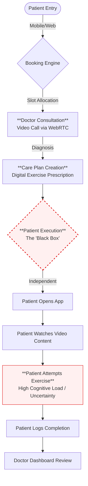
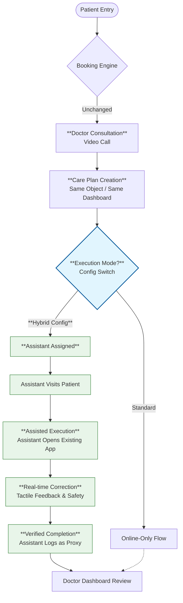

# Workflow Analysis: Integration & Diversion Points
**Reference ID:** PM-HYB-FLOW-002  
**Date:** 2026-01-20  
**Scope:** Operational Workflow & Logic  

---

## 1. The Diversion Logic

The primary risk in hybrid models is "Process Forking," where the offline business runs separately from the online code. 

To maintain the **"One Doctor, One Plan"** principle, we identify a single diversion point: **Post-Prescription Delivery.**

*   **Before this point:** The flow is identical (Booking -> Video -> Plan).
*   **At this point:** A configuration switch determines execution mode.
*   **After this point:** Data converges back to the same Dashboard.

---

## 2. Current Workflow (Linear Online)

Currently, the system relies on a high-friction "Self-Start" mechanism.

**Critical Friction Point:** `Patient Execution`.
At this node, the system loses visibility. We do not know *how* the patient executes, or *if* they execute correctly, until they self-report.

---

## 3. The Hybrid Fork (Reconfigured)

By introducing the conditional branch `IF mode == HYBRID`, we bridge the "Execution Gap" without changing the upstream booking or downstream diagnosis flows.

**The Assistant 'Inject' Strategy:**
The Assistant does not need a new app. They log in to the **Patient's View** (or a proxy view thereof) and execute the *same plan* that the patient would have seen.

## 4. Technical Validation

*   **No New Booking Module:** The Assistant's schedule is slave to the Patient's slot.
*   **No New Clinical Data:** The Assistant inputs standard fields (Reps, Sets, Pain Level), just with higher veracity.
*   **Convergent Analytics:** The Doctor sees "Completed Plans" regardless of mode; the data schema remains uniform.
