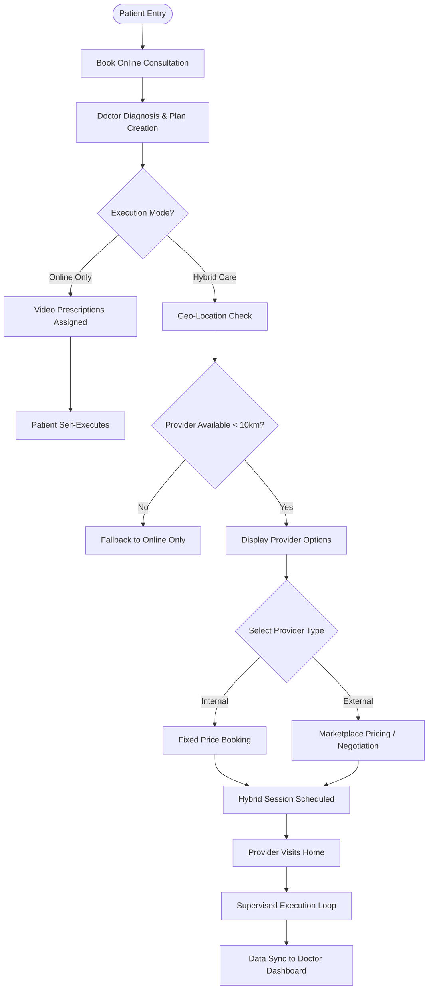

# High-Level Design (HLD): Hybrid Care Extension
**Reference:** PM-HYB-HLD-001
**Scope:** Architecture & Core Flows

## 1. System Architecture Diagram
**Concept:** The Platform acts as the central orchestration engine. "Hybrid" is not a separate application but a configured interaction between the `Patient` and the `Provider Discovery Service` extending the existing core.

```mermaid
graph LR
    subgraph "Core Ecosystem"
    PATIENT[Patient Node]
    DOCTOR[Doctor Node]
    CORE[PhysioMantra Core Platform]
    end

    subgraph "Hybrid Extension Services"
    DISCOVERY[Provider Discovery Service]
    MATCHING[Geo-Spatial Matching Engine]
    end

    subgraph "Execution Layer"
    INT_PROV[Internal Provider<br/>(Salaried)]
    EXT_PROV[External Provider<br/>(Marketplace)]
    end

    PATIENT -- 1. Books Consult --> CORE
    CORE -- 2. Assigns --> DOCTOR
    DOCTOR -- 3. Prescribes Hybrid Plan --> CORE
    
    CORE -- 4. Query Location --> DISCOVERY
    DISCOVERY -- 5. Filter < 10km --> MATCHING
    MATCHING -- 6. Returns Options --> CORE
    
    CORE -- 7. Assigns --> INT_PROV
    CORE -- 7. Assigns --> EXT_PROV
    
    INT_PROV -- 8. Executes & Logs --> CORE
    EXT_PROV -- 8. Executes & Logs --> CORE
```

## 2. Hybrid Booking & Execution Flowchart
**Concept:** Unified entry point. The system forks only at the execution method, maintaining a single source of truth for the Care Plan.


