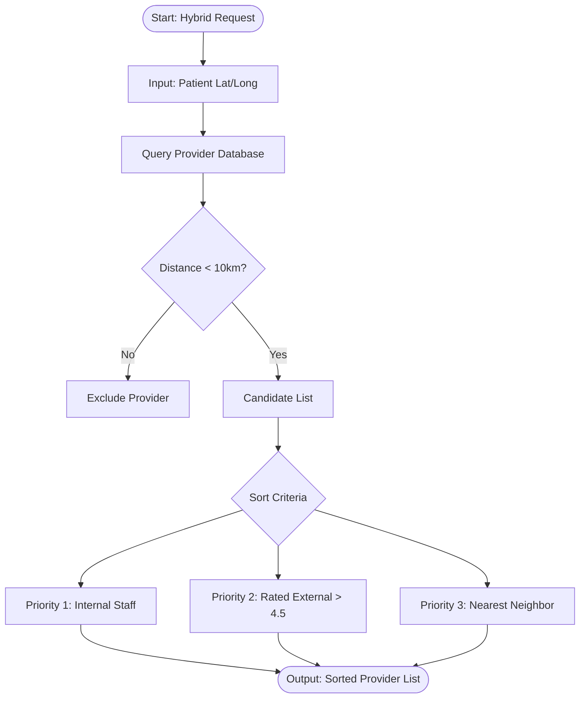
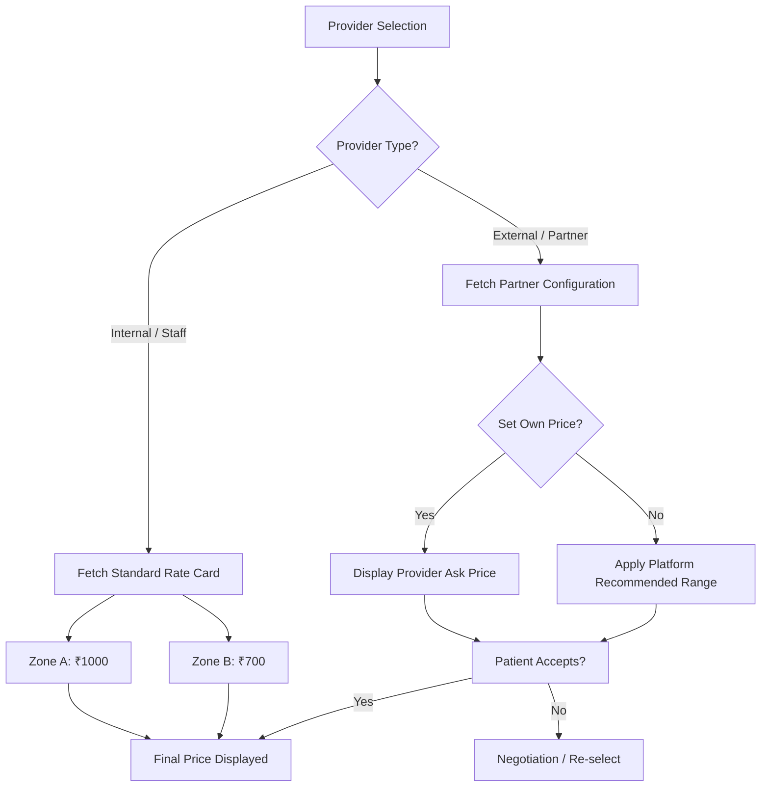

# Low-Level Design (LLD): Logic & Algorithms
**Reference:** PM-HYB-LLD-002
**Scope:** Decision Logic, Pricing & Rules

## 3. Provider Matching Logic
**Constraint:** Max 10km Radius. Prioritize Internal.



## 4. Pricing Decision Flow
**Constraint:** Internal = Fixed; External = Flexible.



## 5. Revenue Split Logic Flow
**Constraint:** Adaptive split based on Provider Type.
**Formula:** Total = Doctor_Fee + Provider_Fee + Platform_Commission

```mermaid
flowchart TD
    Transaction[Payment Captured] --> Check{Provider Type}
    
    Check -->|Internal| Split1[Standard Split]
    Split1 --> D1[Doctor: 20%]
    Split1 --> P1[Provider: Salary via Payroll]
    Split1 --> PL1[Platform: 80% (Gross Revenue)]
    
    Check -->|External| Split2[Marketplace Split]
    Split2 --> D2[Doctor: 15%]
    Split2 --> P2[Provider: 70% (Payout)]
    Split2 --> PL2[Platform: 15% (Commission)]
    
    D1 --> WalletDO[Doctor Wallet]
    PL1 --> WalletPL[Company Account]
    
    D2 --> WalletDO
    P2 --> WalletPR[Provider Wallet]
    PL2 --> WalletPL
```
