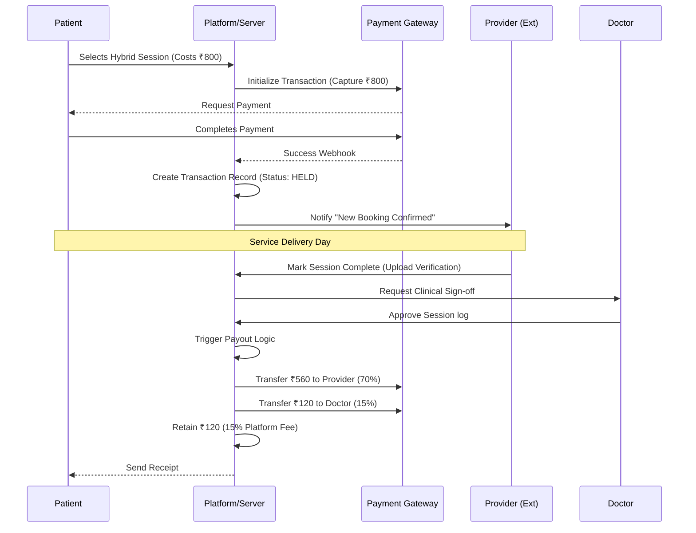
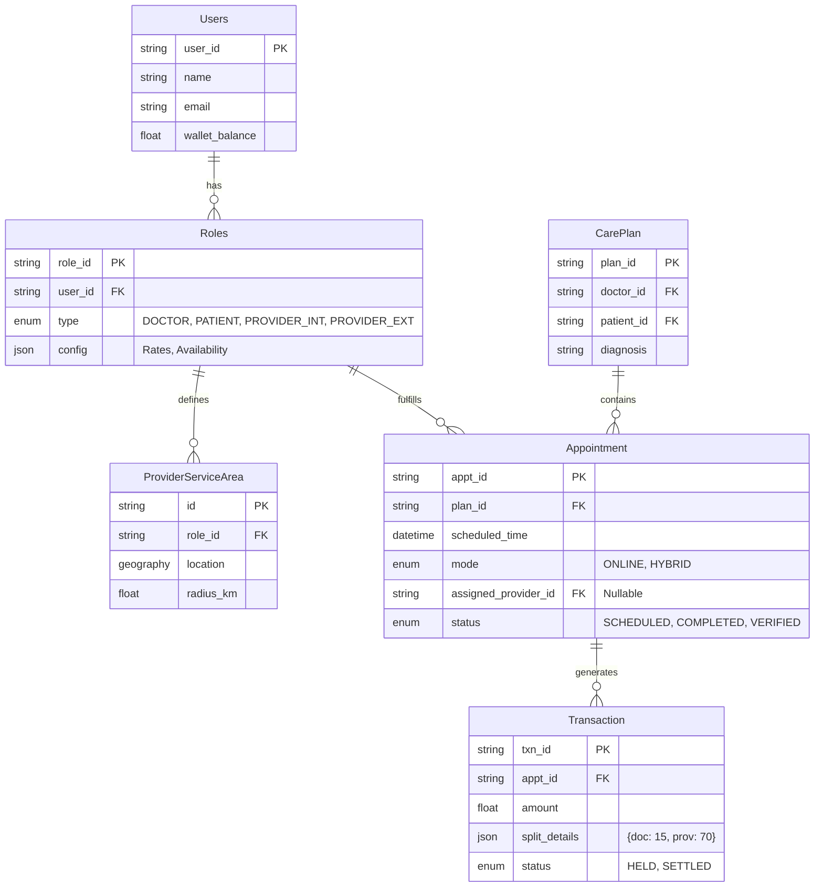

# Low-Level Design (LLD): Data & Sequences
**Reference:** PM-HYB-LLD-003
**Scope:** Database Schema & Transaction Flow

## 6. Payment Sequence Diagram
**Flow:** Booking -> Escrow -> Service Delivery -> Payout

## 7. Data Model Diagram (Entity Relationships)
**Key Change:** `Appointment` entity gains `mode` and `provider_id`. No new tables needed for core logic, just relationship linking.

